<h1 align="center">Hi 👋, I'm Rohan Kudale</h1>
<h3 align="center">Full-Stack Software Developer · India</h3>

  

- 🌱 Full-Stack developer with **1.7+ years** of experience building scalable web and mobile applications for healthcare, education, and enterprise clients.

- 👨‍💻 Portfolio and open-source work at [github.com/rohank-io](https://github.com/rohank-io)

- 💬 Ask me about **REST APIs, Java, Spring Boot, React & system design**

- 📫 **rohanmarutikudale@gmail.com**

- ⚡ Fun fact — I think I'm funny (debatable)

<h3 align="left">Connect with me</h3>

<h3 align="left">Tech Stack</h3>

<h4 align="left">Backend</h4>

<h4 align="left">Frontend</h4>

<h4 align="left">Mobile</h4>

<h4 align="left">Database & Infrastructure</h4>

 

---

<h2 align="center">💼 Project Portfolio</h2>

Production-grade applications built for clinics, consultancies, academies, and fitness centers — spanning web, mobile, and enterprise workflows.

 

<!-- ───────────────────────────── REGROWTH ───────────────────────────── -->

<h3 align="left">🏥 ReGrowth — Clinic Management System</h3>

A comprehensive clinic management system built for <strong>dental clinics</strong>, delivered as both a <strong>web application</strong> and an <strong>Android app</strong>. Streamlines daily operations — from patient records and treatment procedures to medicine inventory and financial reporting.

<strong>Key Features</strong>

&nbsp;&nbsp;◆ Patient management & procedure tracking &nbsp;&nbsp;◆ Medicine inventory management 
&nbsp;&nbsp;◆ In-house medical store stock tracking &nbsp;&nbsp;◆ Analytical dashboard & business insights 
&nbsp;&nbsp;◆ Income & financial reports &nbsp;&nbsp;◆ End-to-end clinic operation management

<table>
  <tr>
    <td align="center">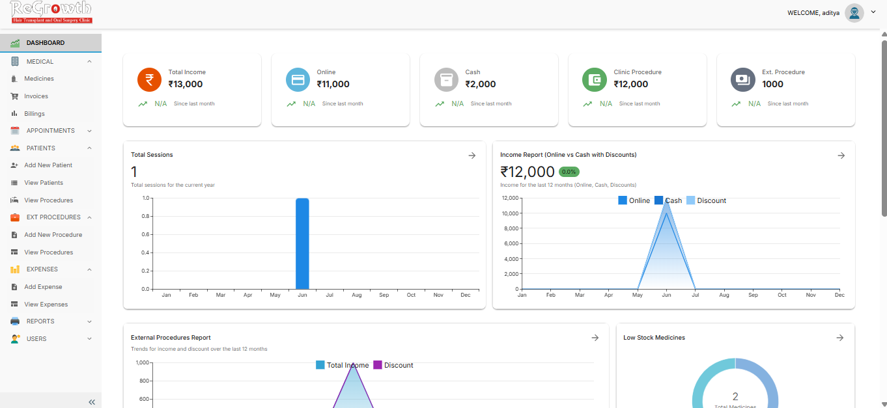 <b>Analytics Dashboard</b></td>
    <td align="center">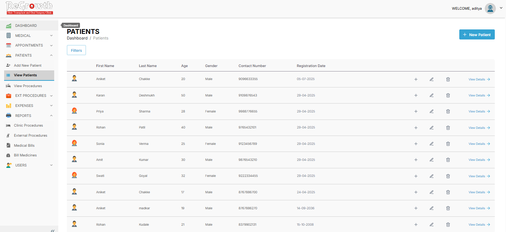 <b>Patient Management</b></td>
  </tr>
  <tr>
    <td align="center"> <b>Medical Bills</b></td>
    <td align="center"> <b>Income Report</b></td>
  </tr>
  <tr>
    <td align="center">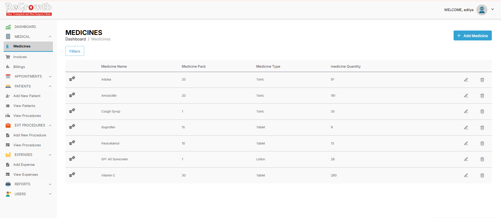 <b>Medicine Inventory</b></td>
    <td align="center"> <b>Stock Tracking</b></td>
  </tr>
  <tr>
    <td align="center" colspan="2"> <b>Procedure Tracking</b></td>
  </tr>
</table>

 

<!-- ───────────────────────────── ORPE ───────────────────────────── -->

<h3 align="left">🏢 ORPE Software — Import-Export Consultancy Platform</h3>

A custom enterprise application for an <strong>Import-Export Consultancy</strong>. Replaces manual Excel workflows by importing large datasets, running business-specific calculations, and generating consultancy-ready reports.

<strong>Key Features</strong>

&nbsp;&nbsp;◆ Excel data import & processing &nbsp;&nbsp;◆ Automated business calculations 
&nbsp;&nbsp;◆ Report generation &nbsp;&nbsp;◆ Data management & analysis 
&nbsp;&nbsp;◆ Custom business workflows tailored to consultancy operations

<table>
  <tr>
    <td align="center">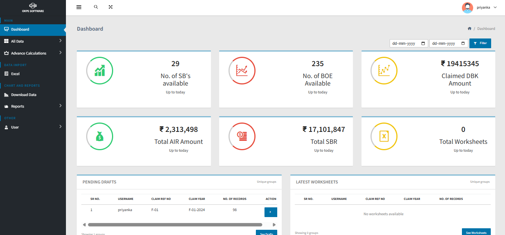 <b>Dashboard</b></td>
    <td align="center"> <b>Excel Data Processing</b></td>
  </tr>
  <tr>
    <td align="center">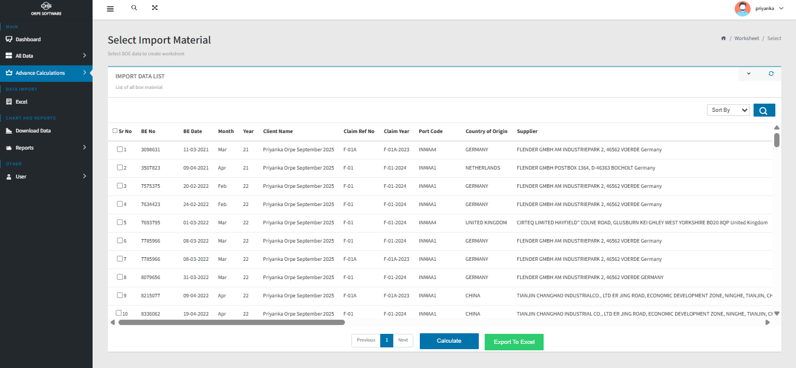 <b>Automated Calculations</b></td>
    <td align="center"> <b>Import Processing</b></td>
  </tr>
</table>

 

<!-- ───────────────────────────── SWARSAMPADA ───────────────────────────── -->

<h3 align="left">🎵 SwarSampada — Music Academy Management System</h3>

A full-featured <strong>web-based management system</strong> for a music academy. Covers the complete student lifecycle — enrollments, attendance, lecture scheduling, fee tracking, and parent communication.

<strong>Key Features</strong>

&nbsp;&nbsp;◆ Student enrollment & attendance tracking &nbsp;&nbsp;◆ Lecture scheduling & management 
&nbsp;&nbsp;◆ Inquiry management &nbsp;&nbsp;◆ Teacher-specific dashboards & screens 
&nbsp;&nbsp;◆ Date-wise lecture reports &nbsp;&nbsp;◆ Fee due tracking & income reports 
&nbsp;&nbsp;◆ Analytical dashboard &nbsp;&nbsp;◆ WhatsApp notifications & alerts

<table>
  <tr>
    <td align="center">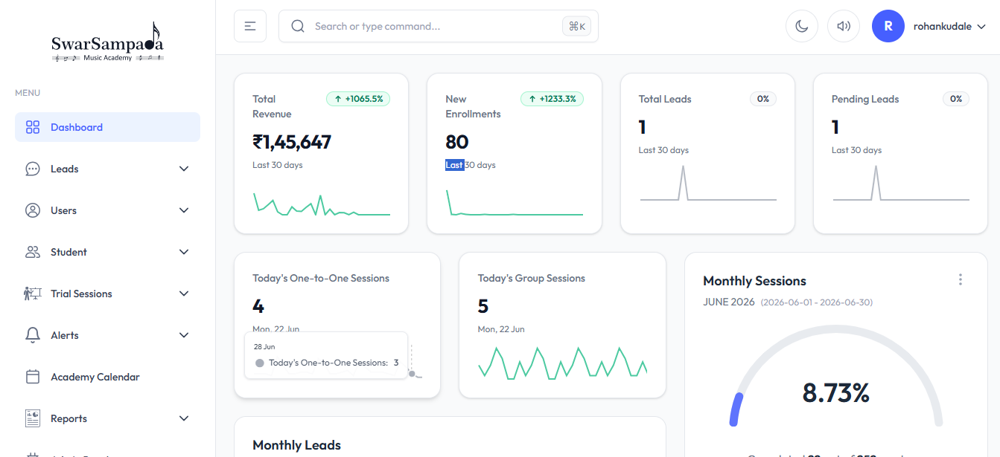 <b>Admin Dashboard</b></td>
    <td align="center">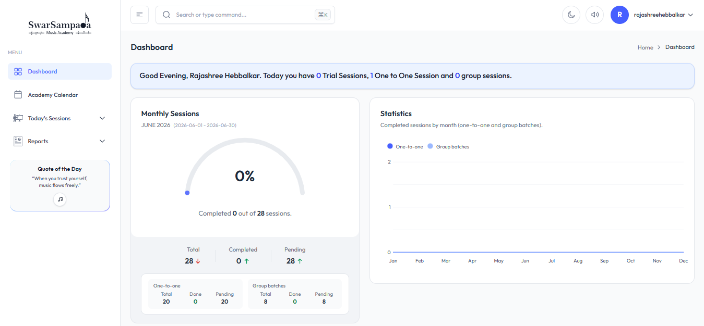 <b>Teacher Dashboard</b></td>
  </tr>
  <tr>
    <td align="center">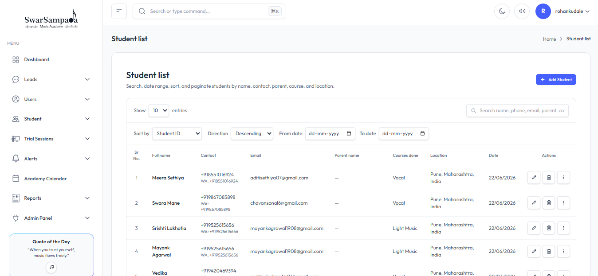 <b>Student Enrollment</b></td>
    <td align="center">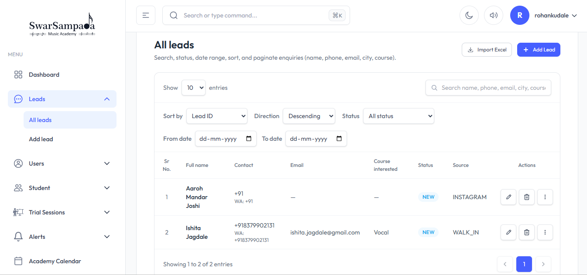 <b>Inquiry Management</b></td>
  </tr>
  <tr>
    <td align="center"> <b>Lecture Scheduling</b></td>
    <td align="center"> <b>Date-wise Lecture Reports</b></td>
  </tr>
  <tr>
    <td align="center">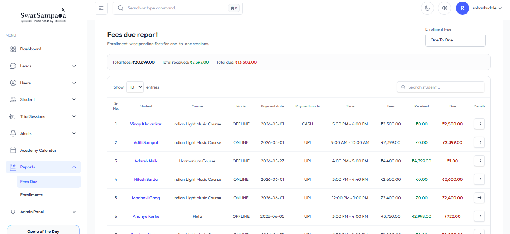 <b>Fee Due Tracking</b></td>
    <td align="center"> <b>WhatsApp Alerts</b></td>
  </tr>
</table>

 

<!-- ───────────────────────────── OM DENTAL ───────────────────────────── -->

<h3 align="left">🦷 Om Dental Clinic — Dental Clinic Management</h3>

A dedicated <strong>web application</strong> for dental clinics to centralize patient information, appointments, and day-to-day operations — with performance monitoring through an analytical dashboard.

<strong>Key Features</strong>

&nbsp;&nbsp;◆ Patient record management &nbsp;&nbsp;◆ Appointment scheduling 
&nbsp;&nbsp;◆ Treatment history tracking &nbsp;&nbsp;◆ Analytical dashboard 
&nbsp;&nbsp;◆ Clinic operation management

 

<!-- ───────────────────────────── YOGSHALA ───────────────────────────── -->

<h3 align="left">🧘 Yogshala — Yoga Academy Management App</h3>

A native <strong>Android application</strong> built for yoga academies and training centers. Simplifies student registrations, fee collections, and long-term record maintenance.

<strong>Key Features</strong>

&nbsp;&nbsp;◆ Student management & new enrollment &nbsp;&nbsp;◆ Fee collection tracking 
&nbsp;&nbsp;◆ Fee due management &nbsp;&nbsp;◆ Student record maintenance

<table>
  <tr>
    <td align="center"> <b>Dashboard</b></td>
    <td align="center"> <b>Student Management</b></td>
    <td align="center"> <b>New Enrollment</b></td>
  </tr>
  <tr>
    <td align="center"> <b>Fee Due Management</b></td>
    <td align="center" colspan="2">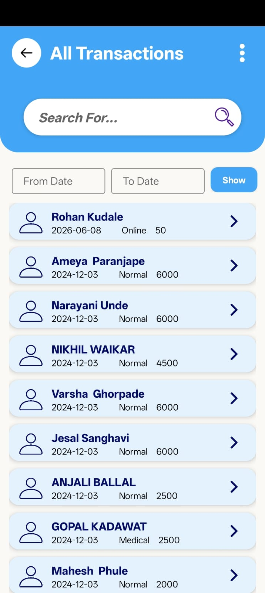 <b>Fee Collection Tracking</b></td>
  </tr>
</table>

 

<!-- ───────────────────────────── FUNFITNESS ───────────────────────────── -->

<h3 align="left">💪 FunFitness — Kids Fitness Academy Management App</h3>

A native <strong>Android application</strong> built for kids fitness academies and training centers. Helps coaches and administrators manage young athlete enrollments, fee collections, and student records — keeping academy operations organized and parents informed.

<strong>Key Features</strong>

&nbsp;&nbsp;◆ Kids & student management &nbsp;&nbsp;◆ New enrollment & registration 
&nbsp;&nbsp;◆ Fee collection tracking &nbsp;&nbsp;◆ Fee due management 
&nbsp;&nbsp;◆ Student record maintenance &nbsp;&nbsp;◆ Academy operation management

 

---

<h3 align="left">GitHub Analytics</h3>

&nbsp;

